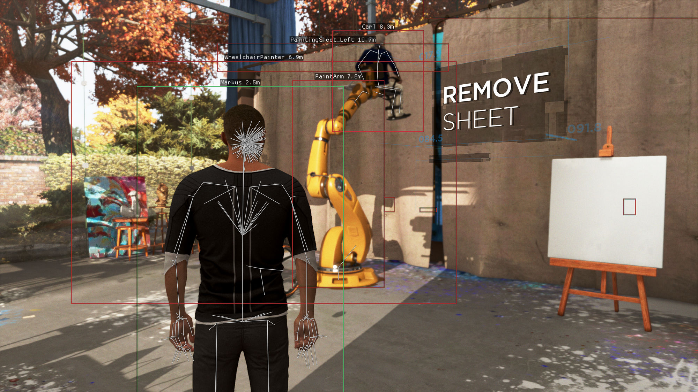

# dbh esp

esp for detroit: become human on linux through proton. boxes, skeletons, names and distance on every character the engine knows about, fish included. it is a vulkan implicit layer, so the game loads it itself and nothing gets injected.

[video](https://www.reddit.com/r/DetroitBecomeHuman/comments/1w4ovnv/comment/p79kfmy/)

## build

needs clang 19 or newer, vulkan headers, lld, make. imgui is vendored.

    make
    make install

`make install` writes the layer manifest into `~/.local/share/vulkan/implicit_layer.d` pointing at the .so in this directory. rebuilds only need `make`, the game has to be restarted to pick them up.

## run

steam launch options for the game:

    DBH_ESP=1 %command%

insert opens the menu. log is in `~/.dbh_esp.log`.

offsets are for the current steam build, 58 mb exe, in `src/offs.hxx`.

## tools

`tools/loc.py` dumps every subtitle in every language out of the bigfiles into `out/`.
`tools/lua.py` pulls the few lua sources that ship in the archive.

the layer also runs `Immediate.lua` from the game directory inside the game's own lua vm whenever the file changes.
